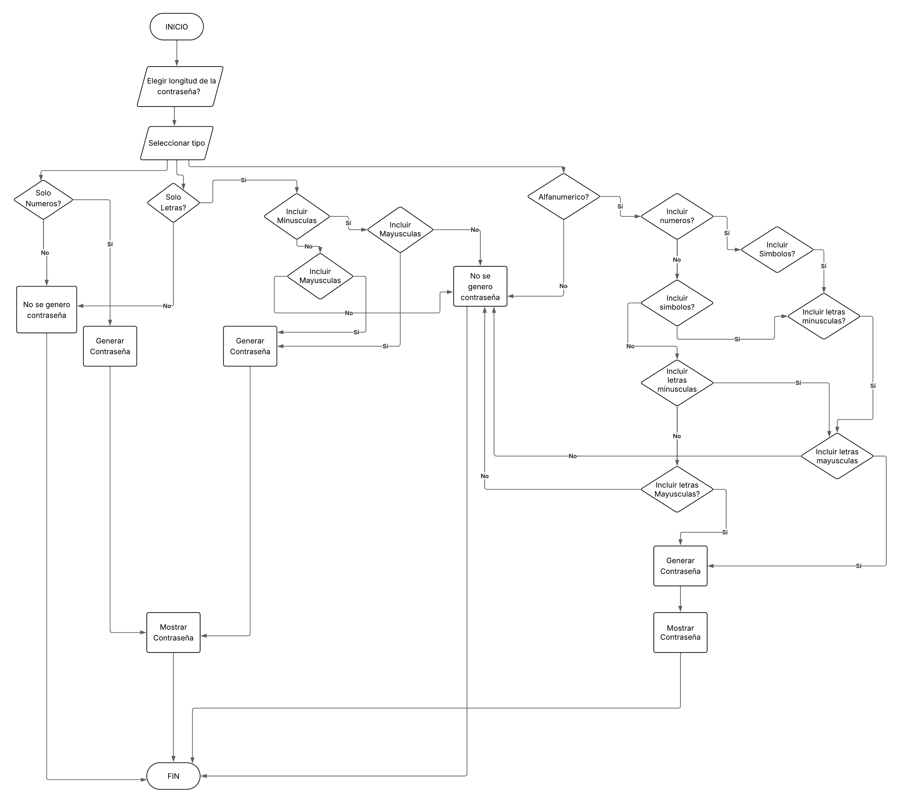

# GeneradorPassword
Sistema que genera contraseñas seguras por consola en python
## ¿Por qué generar contraseñas seguras?

Generar contraseñas seguras es fundamental para proteger la información personal y evitar accesos no autorizados a cuentas, dispositivos y sistemas. Una contraseña segura reduce significativamente el riesgo de ataques como fuerza bruta, diccionario o ingeniería social. Utilizar combinaciones de letras mayúsculas, minúsculas, números y símbolos asegura que la contraseña sea difícil de adivinar y mejora la seguridad general de cualquier entorno digital.

---
**Diagrama de Flujo**



---
## Cómo ejecutar el proyecto

Asegúrate de tener Python instalado. Luego, ejecuta el siguiente comando en la terminal:

```bash
python main.py
