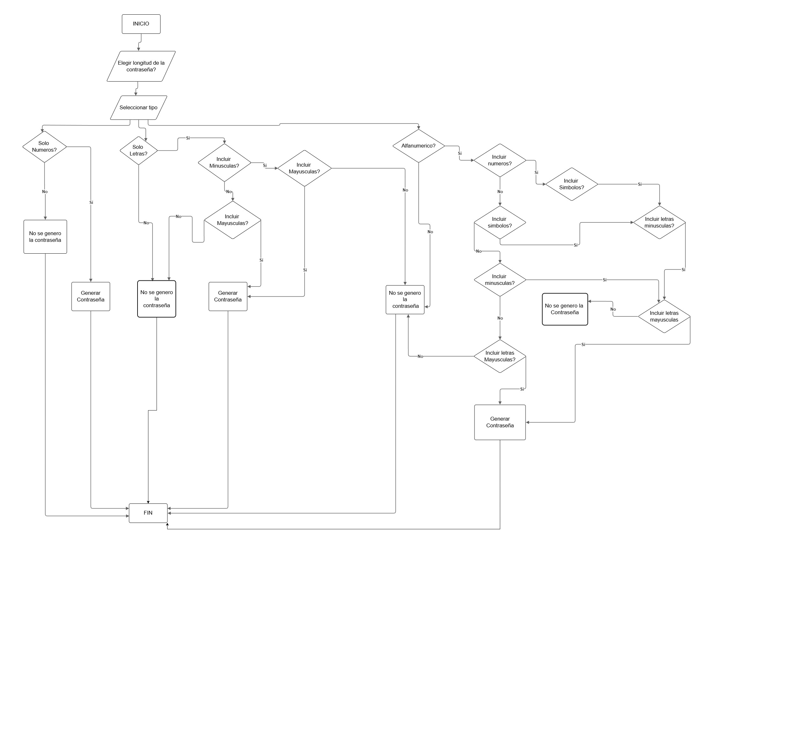
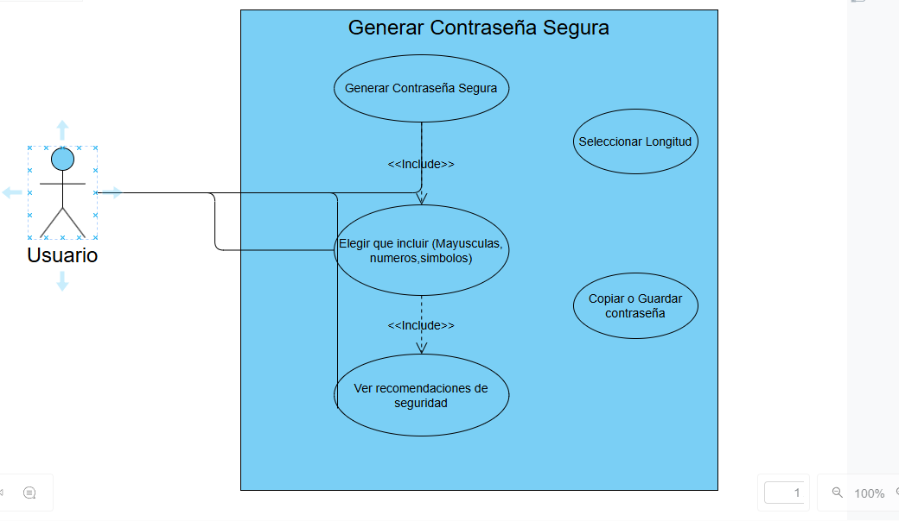
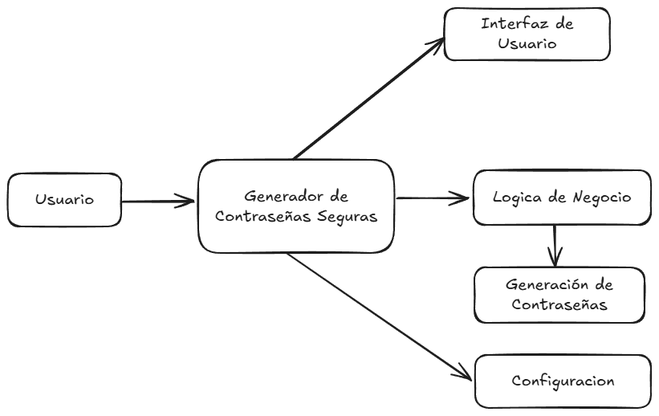
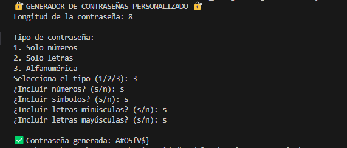

# GeneradorPassword
Sistema que genera contraseñas seguras por consola en python
## ¿Por qué generar contraseñas seguras?

Generar contraseñas seguras es fundamental para proteger la información personal y evitar accesos no autorizados a cuentas, dispositivos y sistemas. Una contraseña segura reduce significativamente el riesgo de ataques como fuerza bruta, diccionario o ingeniería social. Utilizar combinaciones de letras mayúsculas, minúsculas, números y símbolos asegura que la contraseña sea difícil de adivinar y mejora la seguridad general de cualquier entorno digital.

## ¿Cual es la problematica que resuelve este sistema?
En la era digital, muchas personas usan contraseñas débiles, repetidas o predecibles como "123456", "password", o "qwerty", lo que pone en riesgo sus cuentas personales, financieras o profesionales. Además, generar contraseñas seguras manualmente puede ser confuso, lento e inconsistente.
## El sistema resuelve lo siguiente:
    1.Evita contraseñas inseguras o débiles
    2.Ofrece personalización para adaptarse a requisitos específicos
    3.Evita errores comunes en la creación manual
    4.Es rápido, autónomo y fácil de usar
    5. Fomenta buenas prácticas de ciberseguridad
## Conclusion:
Este sistema automatiza la creación de contraseñas seguras, adaptables y confiables, reduciendo los riesgos de seguridad derivados del mal manejo de claves de acceso
---
**Video Demostrativo**

[▶️ Reproducir Video](recursos/video_explicativo.mp4)
---

---
**Diagrama de Flujo**



---
---
**Diagrama de Caso de Uso**



---
---
**Diagrama de Caso de Arquitectura**



---
## Cómo ejecutar el proyecto

Asegúrate de tener Python instalado. Luego, ejecuta el siguiente comando en la terminal:

```bash
python main.py
```
---
**Como se ejecuta el sistema por consola**



---